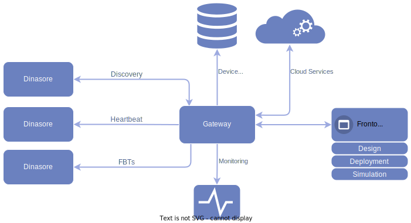

# T-Rex 🦖 (or not)

This repository is dedicated to my master's thesis, which focuses on self-discoverable and configurable **Service-Oriented Architecture** for the design of **Cyber-Physical Production Systems (CPPS)**. This work is mainly based on the [**Dinasore**](https://github.com/DIGI2-FEUP/dinasore) framework, which mey be furthermore used to implement the features developed here.

>❗️Note:
>The system description and diagrams on this page may be outdated, since the features are under active developemnt


## 📁 Project Proposal
The proposal of this project is to design a system that can:
- Detect workers on the network
- Detect cloud-based services  
- Elect a gateway  
- Configure a pipeline of function blocks automatically  

The use of **cloud-based microservices** is part of the pipeline composition if a determined service is not available on the network.

## 🎯 Goals
1. **Service Discovery**  
   Study and implement a **multi-layered service discovery algorithm**, combining:  
   - Local network discovery protocols  
   - API-based mechanisms  

2. **Integration**  
   Merge the developed system with the **Dinasore framework**.  


## ⚙️ System Overview

An initial and general view of the system is illustrated in the diagram below.



The gateway device is elected during the first discovery round, that is, any instantiated Dinasore can potentially become a gateway device.  
What differentiates the gateway node from the worker endpoints is its ability to:
- **Monitor workers**: periodic heartbeat signals.
- **Search for cloud services**: active serach and monitor cloud-based microservices. 
- **Distribute the pipeline**: opens an interface to receive and distribute the FBs.    

## 👀 Discovery Module

The Discovery thread of each device should wait for an browser event during a defined timeout. If no gateway is found, the system assumes itself as a gateway device and register it's service on the network. Every Dinasore subsequently started will search and find the previous gateway device and start announcing itself as a worker device.

The discovery and gateway election process cas be described as the following diagram:


## 📝 Important notes:
### mDNS specs:

- device_name: `MyDevice.local.`
- service_type: `_http._tcp.local.`
- service_name (complete service name): `MyDevice._http._tcp.local.`

| Field           | Description                                                                 |
|-----------------|-----------------------------------------------------------------------------|
| `0*`, `0?`      | DNS Header Flags. `0*` = authority question i.e. the service owner. `0?` = standard query. |
| `[0q]`, `[2q]`  | Number of queries (QdCount). `[0q]` = no queries. `[2q]` = Can be a question asking for a specific PTR and SRV for example.    |
| `5/0/0`         | Registry counting: **Answer / Authority / Additional**. Ex.: 5 in the Answer fiels means we are answering for all 5 register: **PTR**, **SRV**, **TXT**, **A**, **AAAA** and **NSEC**.               |
| `PTR`           | Points a service name to the instance  (`_http._tcp.local.` → service).|
| `SRV`           | Contains the host name, port, priority and wheigt.       |
| `TXT`           | Service metadata (key, value).                                  |
| `A`             | IPv4 record.                                         |
| `AAAA`          | IPv6 record.                                         |
| `NSEC`          | Cache coerence. (indicates the ausence of other types).        |
| `(Cache flush)` | Old records on cach must be discarded.               |
| `TTL`              | Time to keep the record on cache. If equals to zero, indicates the service is not available anymore|


First packets announces a service and a device:
``` text 
18:45:10.112345 IP 192.168.1.50.mdns > 224.0.0.251.mdns: 0*- [0q] 1/0/4 PTR MyDevice._ServiceType._tcp.local. (125)
```
Subsequent servies announces full details about the service, IP and Port:
``` text
18:45:10.325678 IP 192.168.1.50.mdns > 224.0.0.251.mdns: 0*- [0q] 5/0/0 PTR MyDevice._ServiceType._tcp.local., (Cache flush) SRV ServiceName.MyDevice._tcp.local.:ServicePort 0 0, (Cache flush) TXT "rl=1", (Cache flush) A 192.168.1.50, (Cache flush) NSEC (200)
```

## TODO

- [X] Implement the discovery state machine
- [X] integrate the Discover SM and DB interfaces
- [ ] Monitor and update service when the self IP changes
- [ ] Create a configuration file
